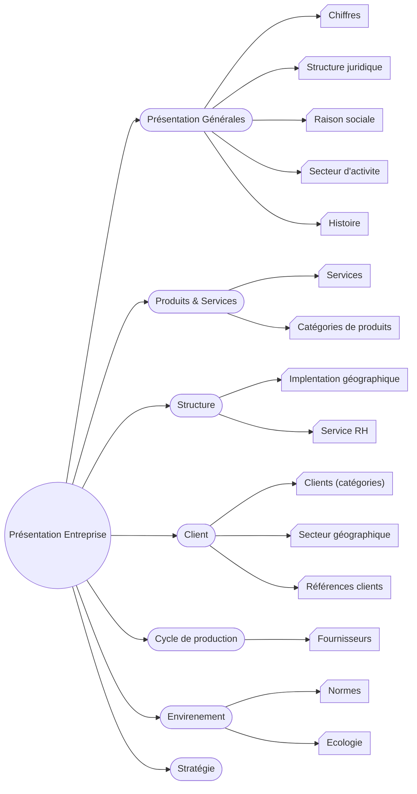

# Présentation Entreprise

```mermaid
graph LR
    A((Présentation Entreprise))
    B@{ shape: stadium, label: "Présentation Générales" }
    C@{ shape: stadium, label: "Produits & Services" }
    D@{ shape: stadium, label: "Structure" }
    E@{ shape: stadium, label: "Client" }
    F@{ shape: stadium, label: "Cycle de production" }
    G@{ shape: stadium, label: "Envirenement" }
    H@{ shape: stadium, label: "Stratégie" }

    
    A --> B
    A --> C
    A --> D
    A --> E
    A --> F
    A --> G
    A --> H

    B1@{ shape: notch-rect, label: "Chiffres" }
    B2@{ shape: notch-rect, label: "Structure juridique" }
    B3@{ shape: notch-rect, label: "Raison sociale" }
    B4@{ shape: notch-rect, label: "Secteur d'activite" }
    B5@{ shape: notch-rect, label: "Histoire" }

    B --> B1
    B --> B2
    B --> B3
    B --> B4
    B --> B5

    C1@{ shape: notch-rect, label: "Services" }
    C2@{ shape: notch-rect, label: "Catégories de produits" }

    C --> C1
    C --> C2

    D1@{ shape: notch-rect, label: "Implentation géographique" }
    D2@{ shape: notch-rect, label: "Service RH" }

    D --> D1
    D --> D2

    E1@{ shape: notch-rect, label: "Clients (catégories)" }
    E2@{ shape: notch-rect, label: "Secteur géographique" }
    E3@{ shape: notch-rect, label: "Références clients" }

    E --> E1
    E --> E2
    E --> E3

    F1@{ shape: notch-rect, label: "Fournisseurs" }

    F --> F1

    G1@{ shape: notch-rect, label: "Normes" }
    G2@{ shape: notch-rect, label: "Ecologie" }

    G --> G1
    G --> G2

```
